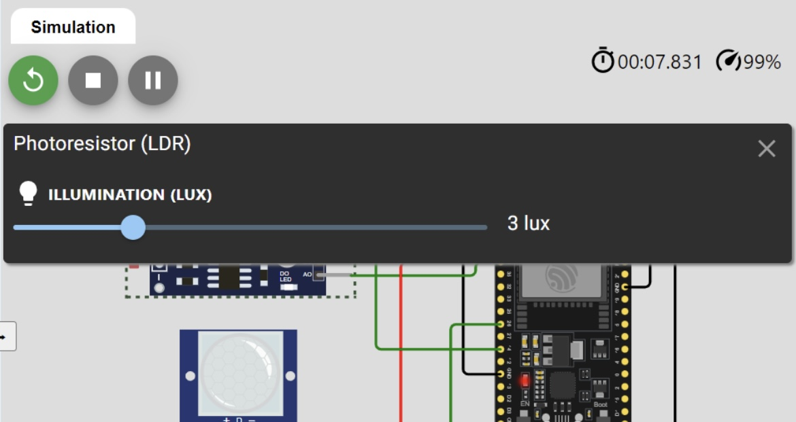
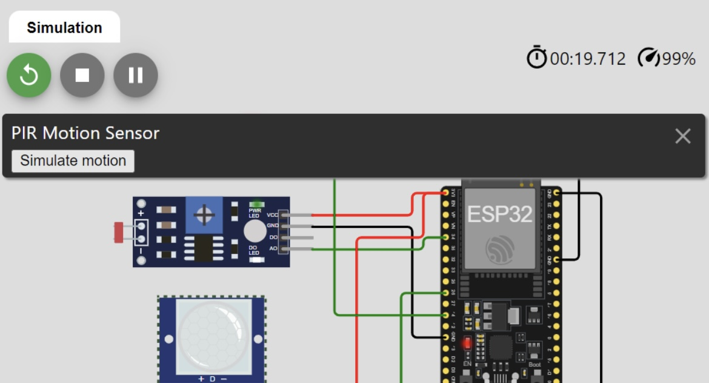
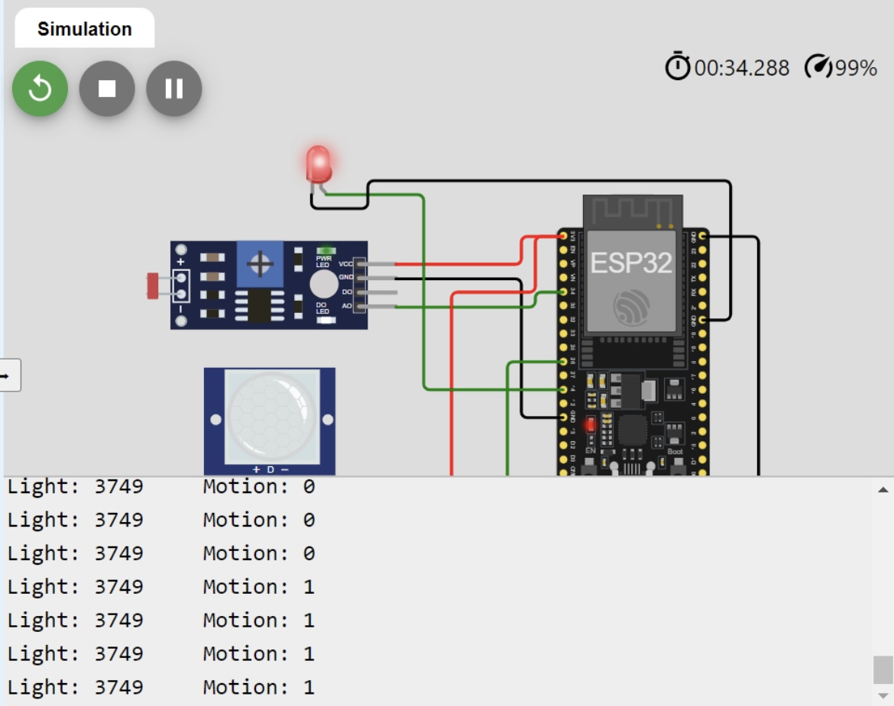
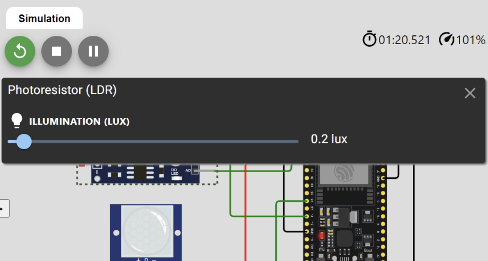
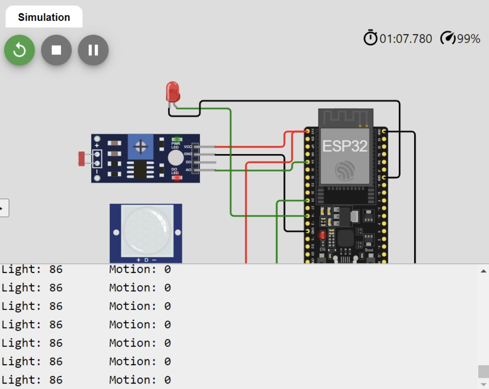
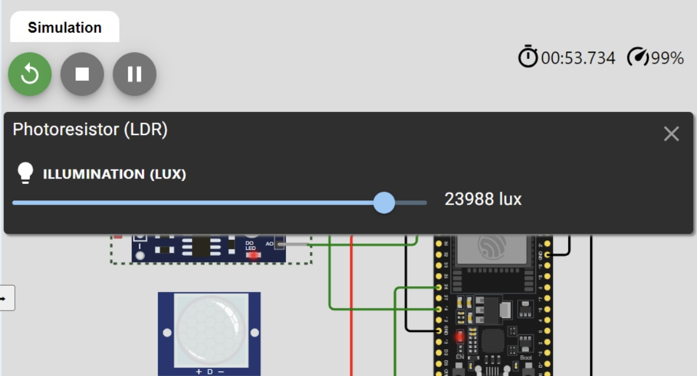
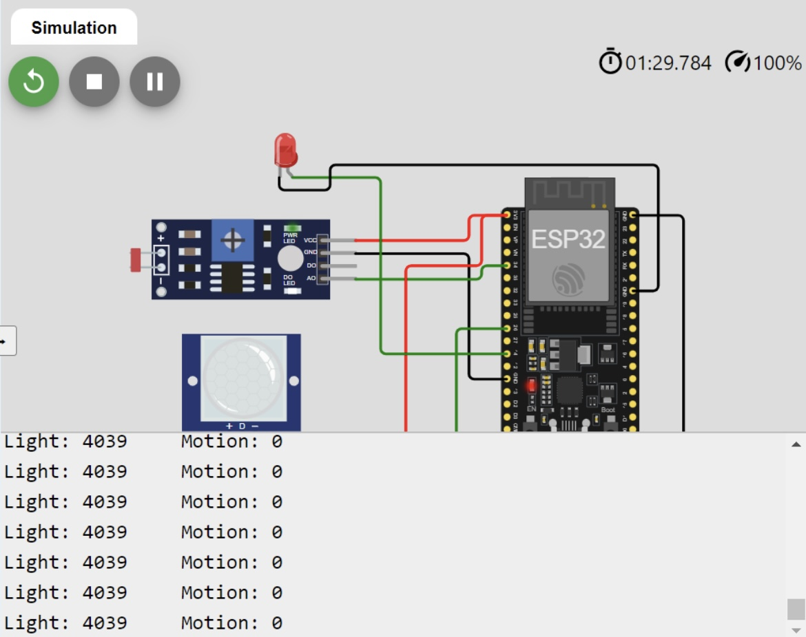

# ESP32-Light-Motion-Sensor

## Description

This project demonstrates how to use an ESP32 microcontroller with a PIR motion sensor and an LDR light sensor to control a bulb. The bulb turns on when there is no light and motion is detected, and turns off otherwise.

## Components Used:

- ESP32
- PIR Motion Sensor
- LDR Light Sensor
- LED (acting as the bulb)
- connecting wires

## Circuit Diagram:

- LED: Connect the anode to GPIO 14 of ESP32 and the cathode to GND.
- PIR Motion Sensor: Connect VCC to 3V3, OUT to GPIO 26, and GND to GND.
- LDR Light Sensor: Connect one end to 3V3 and the other end to a voltage divider (with a resistor) connected to GND and GPIO 34.

## Explanation:

- lightSensorPin: Reads the analog value from the LDR sensor.
- motionSensorPin: Reads the digital value from the PIR motion sensor.
- bulbPin: Controls the LED (acting as the bulb).
- The loop continuously reads the sensor values and controls the LED based on the conditions.

## Demonstration:

1. When there is no light and there is movement, the bulb turns on:

2. When there is no light or movement, the bulb is off:

3. When there is light and no movement, the bulb is off:

## Wokwi Simulation Link:

You can view and simulate the project on Wokwi using this [link](https://wokwi.com/projects/405415298045977601).

